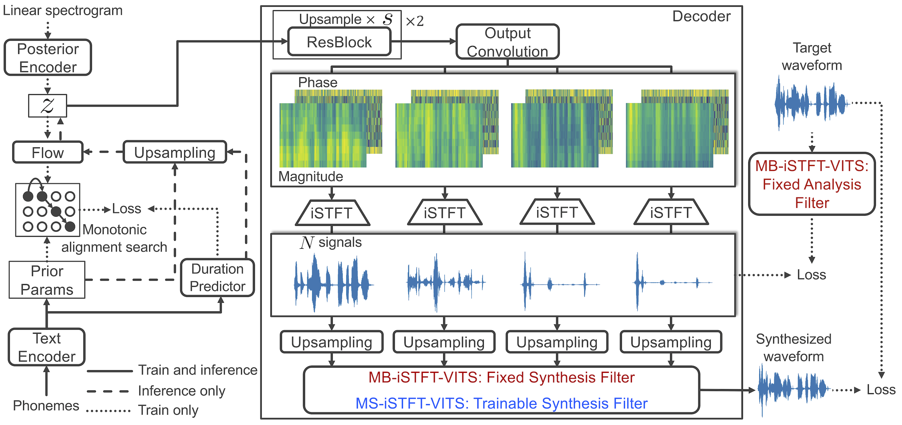
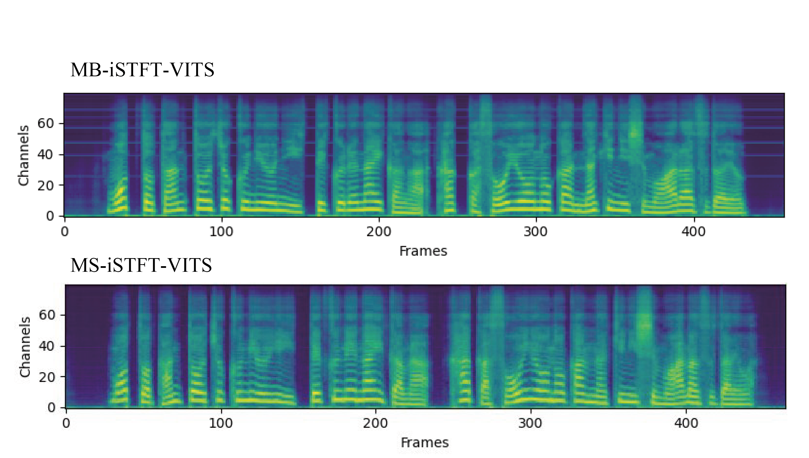

# 【44100Hz(FullBand) and Ja Support】Lightweight and High-Fidelity End-to-End Text-to-Speech with Multi-Band Generation and Inverse Short-Time Fourier Transform 

このレポジトリは、 日本語対応を行い、44100Hzの音声を学習および出力できるように編集した[MB-iSTFT-VITS](https://github.com/MasayaKawamura/MB-iSTFT-VITS)です。44100Hz化した際、pseudo-QMFを用いた合成では定周波ノイズが発生したため、合成フィルタを学習パラメータにすることで柔軟に対応できるようにしたMS-iSTFT-VITS実装のみを対象にしています。


## サンプル出力 : [JSUT 10k step sample](https://drive.google.com/file/d/1gYdfn17cW_8NwuQW-ZgraIdV2LZB5FZF/)




## 1. 環境構築

0. Pythonバージョン3.8環境を用意する（3.6以上であれば問題ないはず）
0. このレポジトリをクローンする（もしくはDownload Zipでダウンロードする）

    ```sh
    git clone https://github.com/AcogiMin/MB-iSTFT-VITS-44100Hz-Ja.git
    ```

0. [https://pytorch.org/](https://pytorch.org/)のURLよりPyTorch1.13.1をインストールする（_VF.stftの部分でエラーで止まったら違うバージョンに変える）

0. 必要なパッケージを一括インストール. 
    ```sh
    pip install -r requirements.txt
    ```
0. MAS(Monotonic Alignment Search)をビルドする（必要であればpreprocessする、多分必要ない
    ```sh
    # Cython-version Monotonoic Alignment Search
    cd monotonic_align
    mkdir monotonic_align
    python setup.py build_ext --inplace
    ```

## 2. データセットの準備

-  JSUT Basic5000を使用する場合
    1. [JSUT Speech dataset](https://sites.google.com/site/shinnosuketakamichi/publication/jsut)をダウンロードし、展開する。BASIC5000のwavを44100Hz/16bitに変換し、wavファイルが格納されているフォルダ宛にシンボリックリンクを作成する。 
    ```sh
    ln -s ./path/to/jsut_ver1.1/basic5000/44100Hz16bit/wav/ DUMMY_PATH
    ```
-  ITAコーパスを使用する場合(例：[あみたろの声素材工房](https://amitaro.net/) 様)
    1. [ITAコーパス読み上げ音声](https://amitaro.net/voice/corpus-list/ita/)をダウンロードし、展開する。RECITATIONとEMOTIONのwavを44100Hzに変換し、一つのフォルダに纏めて入れて、そのフォルダ宛にシンボリックリンクを作成する。 
    ```sh
    ln -s ./path/to/ita_corpus/44100Hz16bit/wav/ DUMMY_PATH
    ```
    このとき、Recitation音声のファイル名はRECITATION324_xxx.wav、Emotion音声のファイル名はEMOTION100_xxx.wavとなっていない場合は、適宜filelistフォルダ内のita_corpus_audio_text_train(test,val)_filelist.txtのファイル名の部分を、用意したITAコーパスのファイル名に編集する。
-   自分でデータセットを作成する場合
    1. 以下の要素に注意して、44100Hz16bitの読み上げ音声を準備する。([What makes a good TTS dataset](https://github.com/coqui-ai/TTS/wiki/What-makes-a-good-TTS-dataset)より)
        - テキストや発話の長さが正規分布感になってること。
        - テキストデータと発話音声に間違いがないこと。
        - 背景ノイズが無いこと。
        - 発話音声データ間で、話し方が似通っていること。
        - 使用する言語の音素を網羅していること。
        - 声色や音程の違い等をできるだけ自然に録音していること。
    1. filelistsフォルダ内のyour_own_dataset_audio_text_train(val,test)_filelist.txtにwavパスと発声されている文字を書き込んでゆく。
    

> ⚠サンプリングレート[Hz]や量子化ビット数[bit]を変更するのを忘れないこと

## 3. [configs](configs)フォルダ内のjsonを編集
主要なパラメータを説明します。必要であれば編集してください。
| 分類 | パラメータ名 | 説明 |
|:-----------:|:------------:|:------------:|
| train       | log_interval        | 何ステップ毎にロス計算を表示するか         |
| train     | eval_interval      | 何ステップ毎にモデル評価を行いモデルを保存するか       |
| train      | epochs        | 学習データ全体を何周学習するか         |
| train       | batch_size          | 一度のパラメータ更新に使用する学習データ数           |
| train       | finetune_model_dir       | ファインチューニング用のcheckpointsが入っているフォルダ       |
| data    | training_files     | 学習用filelistのテキストパス      |
| data    | validation_files     | 検証用filelistのテキストパス      |
| data    | cleaned_text     | filelistの書き起こし文が音素列であればtrue、通常の文であればfalse      |

## 4. 学習
次のコマンドを入力することで、学習を開始する。

-  JSUT Basic5000を使用する場合
```sh
python train_latest.py -c configs/jsut_fullband.json -m JSUT_BASIC5000
```

-  ITAコーパスを使用する場合
```sh
python train_latest.py -c configs/ita_corpus_fullband.json -m ITA_CORPUS
```

- 自分でデータセットを作成した場合
```sh
python train_latest.py -c configs/your_own_dataset_fullband.json -m your_own_dataset
```

また、学習の途中経過はターミナルにも表示されるが、tensorboardを用いて確認することを推奨する。
```sh
tensorboard --logdir=path/to/tensorboard/log/
```

## 5. 推論
学習終了後、音声合成は[inference.ipynb](inference.ipynb)で行うことが出来ます。ファイルパスに気をつけながら実行してください。

## 6.ファインチューニング
ファインチューニングを行う場合は、生成器モデルのcheckpointをG_0.pth、識別器モデルのcheckpointsをD_0.pthに名前を変更し、finetuning_weightフォルダへと配置する。その後、学習を開始することで、ファインチューニングを行うことが出来る。

> ファインチューニング用のcheckpointsは、後ほど公開します。


## 付録
- FullBand化におけるMB-iSTFT-VITSの定周波ノイズについて。横線が入っているとﾋﾟｰ（ファの音あたり）というノイズが発生したが、MS-iSTFT-VITSの方では発生しませんでした。モデル設定は共通にしてあるので、学習可能なフィルタが貢献しているかもしれません。



## 参考文献
- https://github.com/jaywalnut310/vits.git
- https://github.com/rishikksh20/iSTFTNet-pytorch.git
- https://github.com/rishikksh20/melgan.git
